# DCRE — USPTO Drawings (Mermaid Source of Truth)

This document contains the complete, authoritative diagram source for the
**Deterministic Computation with Replayable Evolution (DCRE)** patent family.

All figures are schematic, black-and-white, examiner-friendly, and correspond
directly to the written specification.  
Each figure is intended to be exported individually (SVG or 300-dpi PNG)
and assembled into a USPTO-compliant drawings PDF (one figure per page).

---

## Brief Description of the Drawings

FIG. 1 illustrates an overall system architecture for deterministic computation
with replayable evolution.

FIG. 2 illustrates a bounded modular lattice state space with fixed topology.

FIG. 3 illustrates a local block transformation using a modular integer matrix.

FIG. 4 illustrates sparse delta evolution between lattice epochs.

FIG. 5 illustrates verification by replay and fingerprint comparison.

FIG. 6 illustrates a deterministic receipt structure.

FIG. 7 illustrates triangulation-free communication using shared deterministic lanes.

FIG. 8 illustrates message encoding as deterministic lattice perturbation.

FIG. 9 illustrates epoch synchronization and bounded replay windows.

FIG. 10 illustrates separation of observer and verifier roles.

FIG. 11 illustrates deterministic ordering of delta application.

FIG. 12 illustrates contrast between address-based communication and
signature-based recognition.

FIG. 13 illustrates parallel lanes and channel isolation.

FIG. 14 illustrates deterministic collision handling and anti-jamming.

FIG. 15 illustrates the key system components and their interactions.

FIG. 16 illustrates transform families and their reversibility.

---

## Global Init (Monochrome / Exam-Friendly)

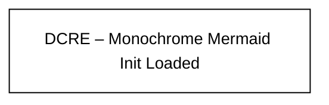

## FIG. 1 — DCRE End-to-End System Overview

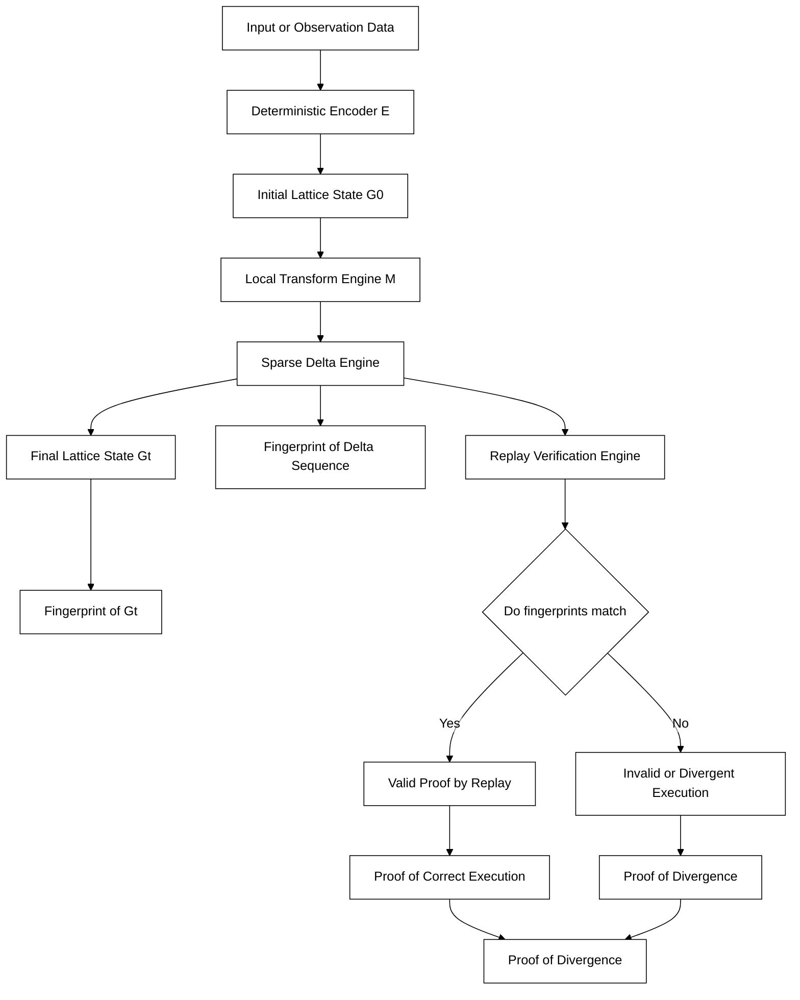

FIG. 1 illustrates an end-to-end system for deterministic computation with replayable evolution. Input or observation data is deterministically encoded into an initial lattice state G0 defined over a bounded modular grid. The lattice state evolves through local block transformations using a transform matrix operating modulo a fixed modulus. State changes are recorded as sparse delta representations. Verification is performed by replaying the delta sequence from the initial lattice state and comparing computed fingerprints to establish proof of correct execution.

## FIG. 2 — Bounded Modular Lattice Structure

```mermaid
%%{init: {
  "theme": "base",
    "flowchart": {
        "htmlLabels": false
    },
  "themeVariables": {
    "fontFamily": "Arial",
    "fontSize": "14px",
    "primaryColor": "#ffffff",
    "primaryTextColor": "#000000",
    "primaryBorderColor": "#000000",
    "lineColor": "#000000",
    "secondaryColor": "#ffffff",
    "tertiaryColor": "#ffffff",
    "noteBkgColor": "#ffffff",
    "noteTextColor": "#000000",
    "textColor": "#000000"
  },
  "flowchart": { "curve": "linear" }
}}%%
flowchart TB
  subgraph G[Bounded Lattice Grid]
    direction LR
    C11[Cell] --- C12[Cell] --- C13[Cell]
    C21[Cell] --- C22[Cell] --- C23[Cell]
    C31[Cell] --- C32[Cell] --- C33[Cell]
  end
  R1[Fixed grid dimensions] --> G
  R2[Each cell stores bounded value] --> G
  R3[No overflow and no carry] --> G
  R4[Zero is a normal cell value] --> G
  N1{{Fixed n\n×n grid}} --- G
  N2{{Values bounded 0..m−1}} --- G
  N3{{Digit-wise arithmetic\nNo carry propagation}} --- G

  Note1{{All cell values are bounded residues in Z_m<br/>Digit-wise arithmetic, no carry propagation<br/>Zero is first-class}} 

  classDef op stroke:#000,stroke-width:2px,fill:#fff,color:#000;
  ```

## FIG. 3 — Local Block Transformation (Matrix Evolution) (Axiom 9)

```mermaid
%%{init: {
  "theme": "base",
    "flowchart": {
        "htmlLabels": false
    },
  "themeVariables": {
    "fontFamily": "Arial",
    "fontSize": "14px",
    "primaryColor": "#ffffff",
    "primaryTextColor": "#000000",
    "primaryBorderColor": "#000000",
    "lineColor": "#000000",
    "secondaryColor": "#ffffff",
    "tertiaryColor": "#ffffff",
    "noteBkgColor": "#ffffff",
    "noteTextColor": "#000000",
    "textColor": "#000000"
  },
  "flowchart": { "curve": "linear" }
}}%%
flowchart LR
  B0[Local Block at epoch t] --> M[Apply Matrix Transform M]
  M --> B1[Local Block at epoch t plus 1]
  R[Only local neighborhood is read and written] --- M
  Note1{{Local block transformation using matrix M}} --- B0
  Note2{{Matrix M is fixed and known}} --- M
  Note3{{Matrix M is applied modulo m}} --- B1

  classDef op stroke:#000,stroke-width:2px,fill:#fff,color:#000;
```

## FIG. 4 — Sparse Delta Evolution (Axioms 12–13)

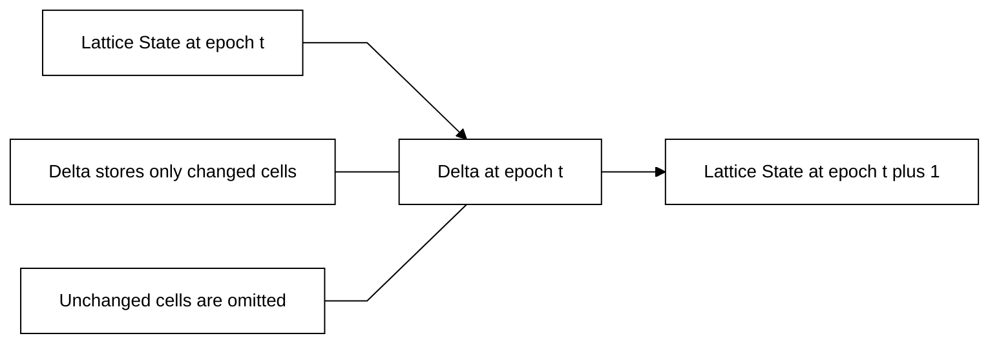

## FIG. 5 — Proof by Replay Verification (Axiom 18)

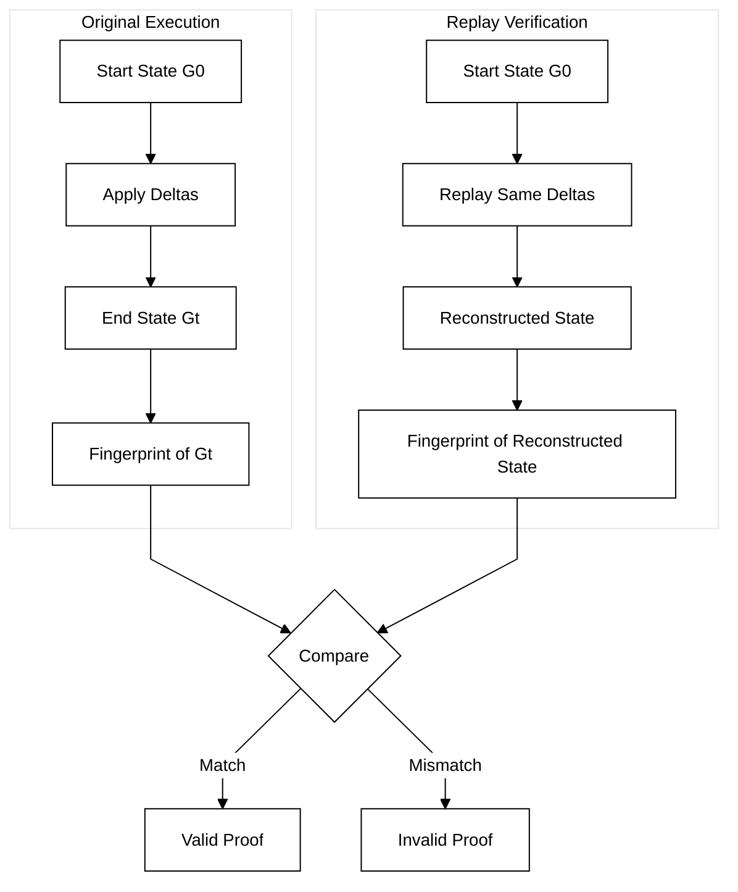

## FIG. 6 — Deterministic Receipt Structure

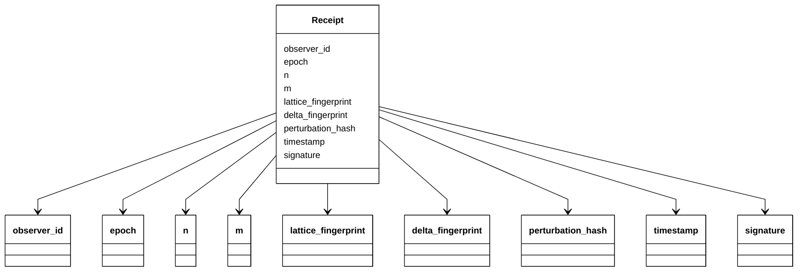

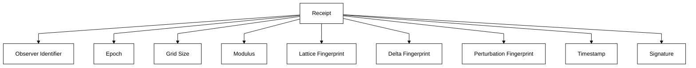

## FIG. 7 — Triangulation-Free “Bowling Alley” Communication Lane

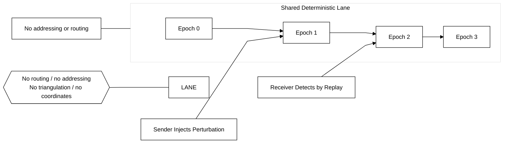

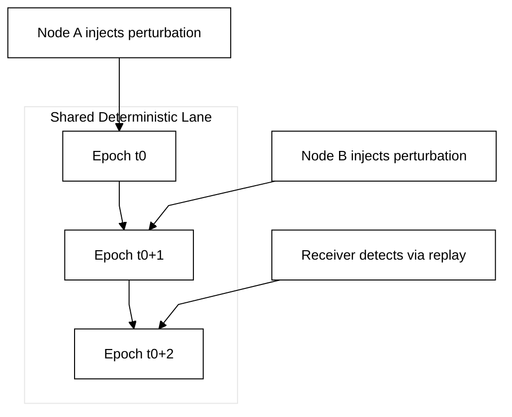

## FIG. 8 — Message Encoding as Deterministic Lattice Perturbation

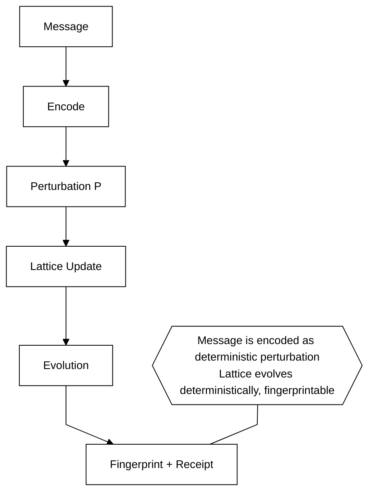

## FIG. 9 — Epoch Synchronization and Replay Window

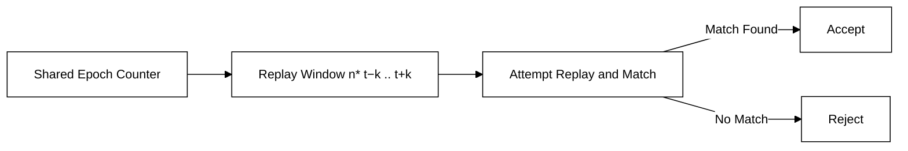

## FIG. 10 — Observer and Verifier Roles

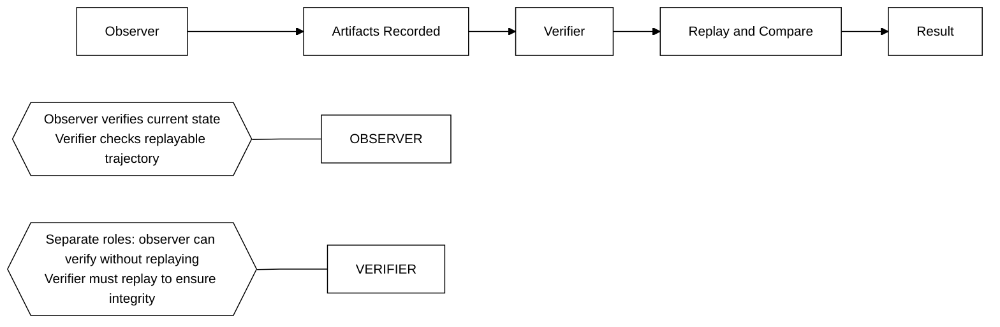

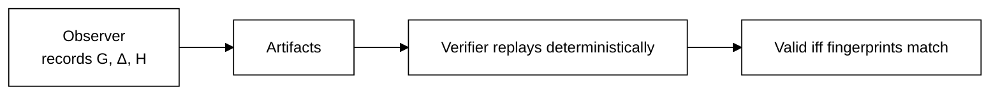

## FIG. 11 — Deterministic Ordering of Delta Application

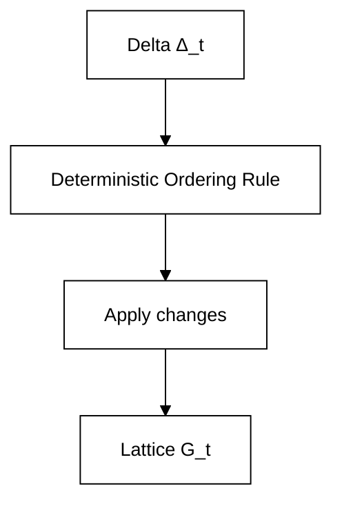

## FIG. 12 — Address-Based vs. Signature-Based Communication

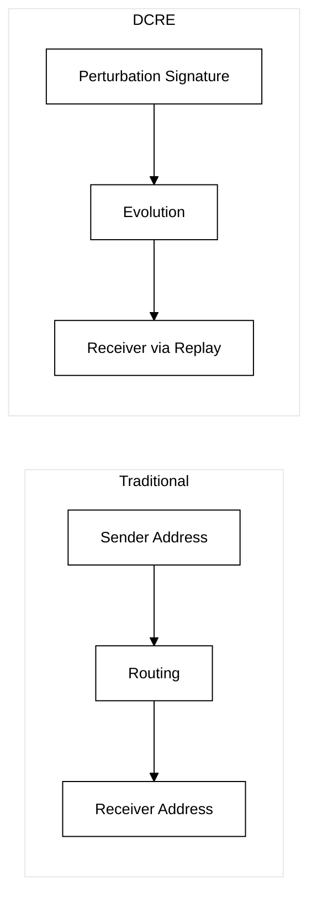

## FIG. 13 — Parallel Lanes / Channel Isolation

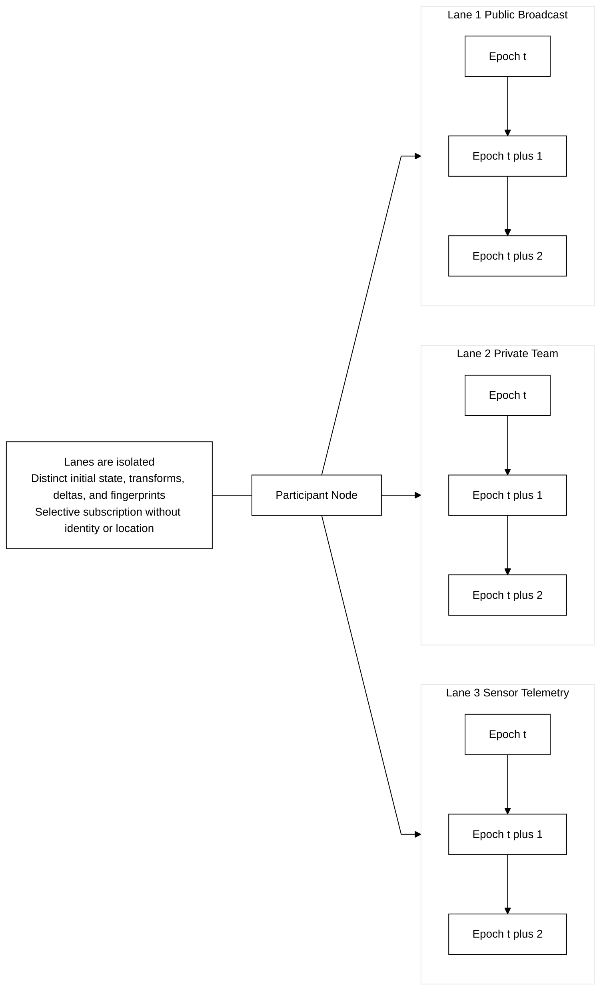

## FIG. 14 — Deterministic Collision Handling / Anti-Jamming

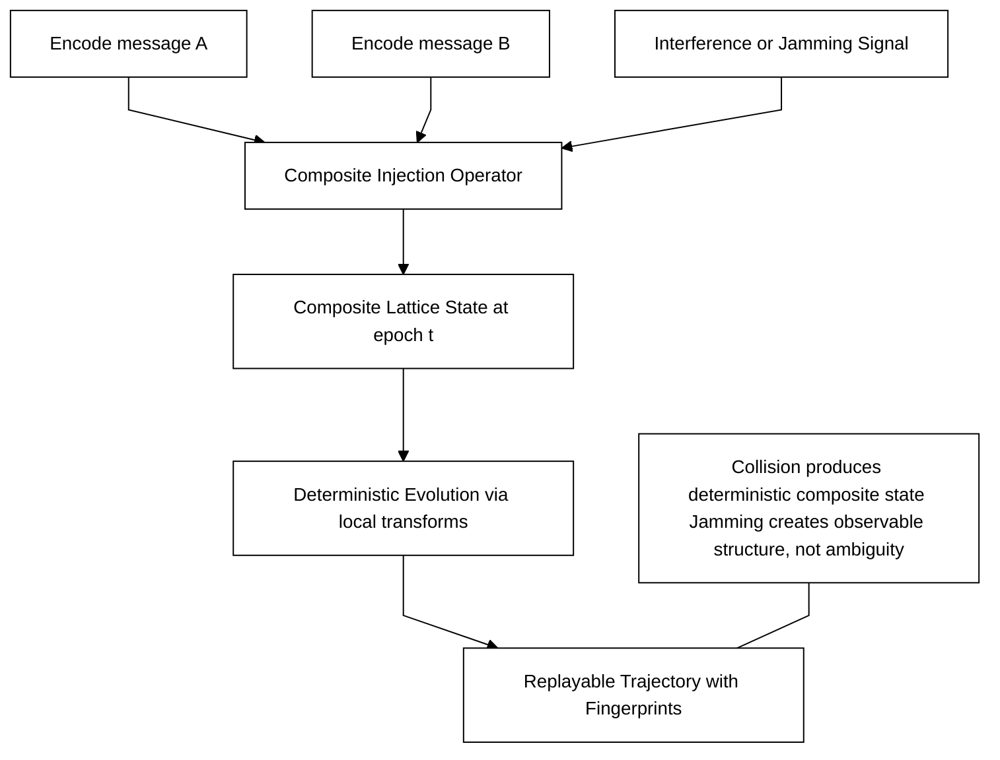


## FIG. 15 — System Components

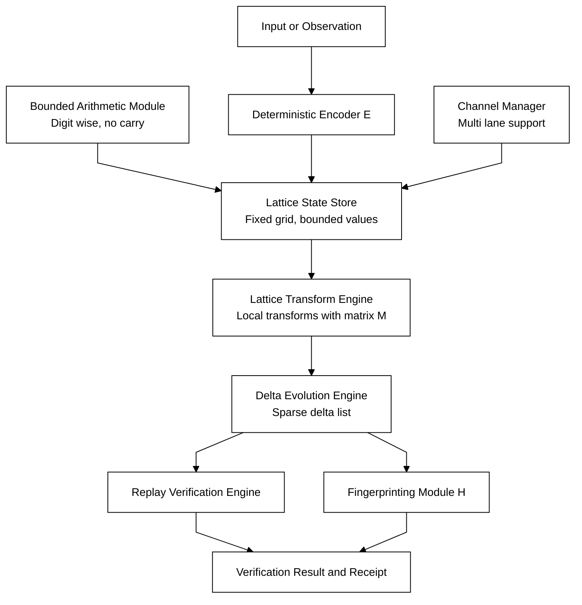

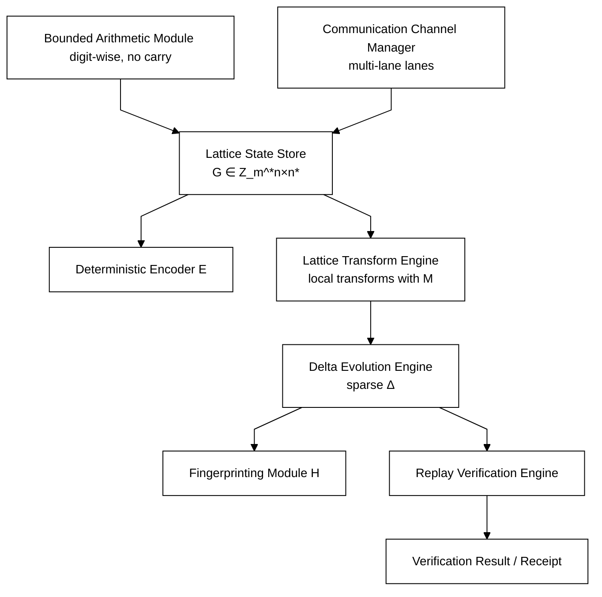

## FIG. 16 — Transform Families & Reversibility

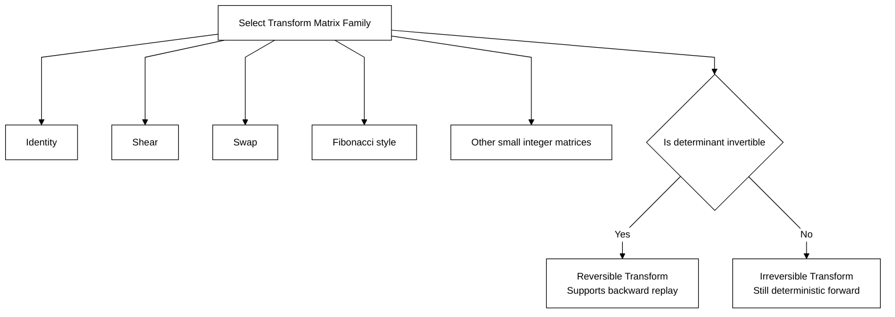